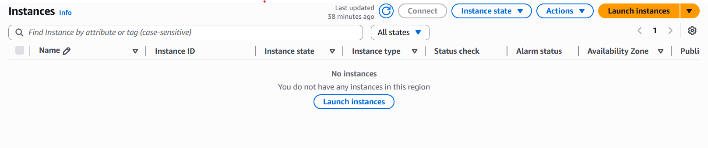
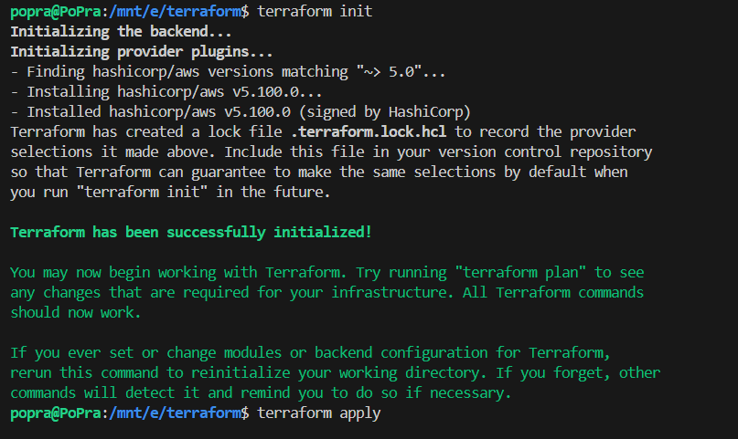
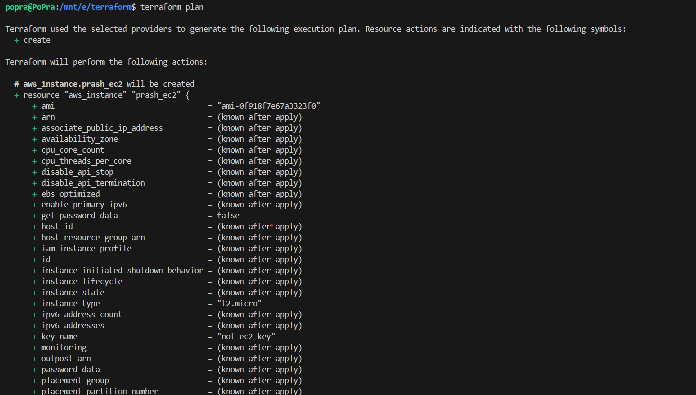
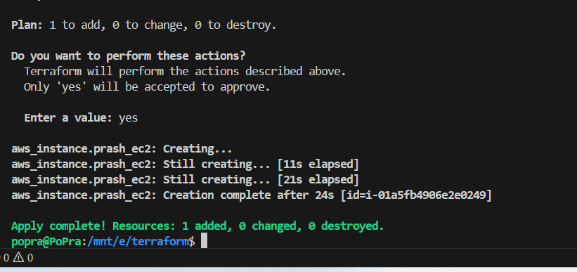
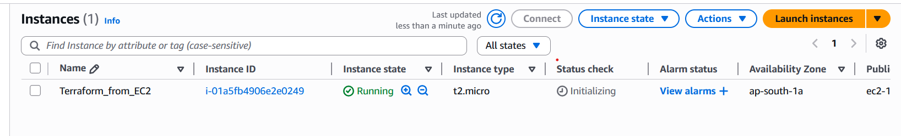
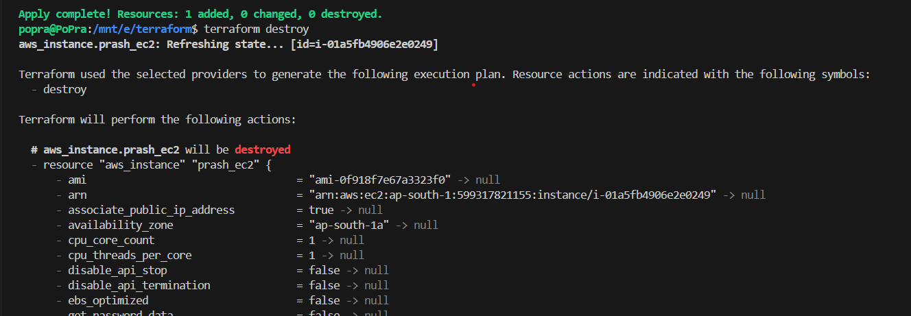
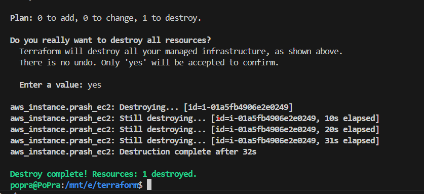
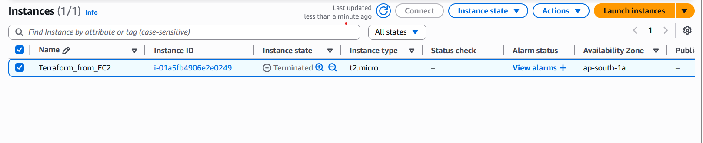

## Here, we are going to create a simple ec2 instance:

# Creating an EC2 Instance with Terraform

This guide explains how to create and delete an EC2 instance using Terraform.  
It shows each step with screenshots.

---

## 1. AWS Dashboard Before Starting

Here is the AWS EC2 dashboard before creating the instance.

  
*This is the AWS dashboard after the instance is created.*

---

## 2. Initialize Terraform

Run the command:

```bash
terraform init
```


This command downloads the necessary Terraform plugins and sets up the working directory.

## 3. Plan the Terraform Changes

Run the command:

```bash
terraform plan
```
  

This shows what Terraform will create, without making any changes yet.

## 4. Apply the Terraform Plan

Run the command:
```bash
terraform apply
```
  

This command creates the EC2 instance in AWS.

## 5. AWS Dashboard After Creation

  

You can now see the new EC2 instance in the AWS dashboard.

## 6. Destroy the Terraform Resources

Run the command:

```bash
terraform destroy
```
  
This command will delete the EC2 instance.
  

## 7. Destroy Confirmation


Terraform asks for confirmation before deleting the resources.

## 8. AWS Dashboard After Deletion


The EC2 instance is now deleted from AWS.

## Conclusion

You have now seen how to create and delete an EC2 instance using Terraform.
The steps are:

    Initialize Terraform

    Plan the changes

    Apply to create the instance

    Destroy to remove the instance